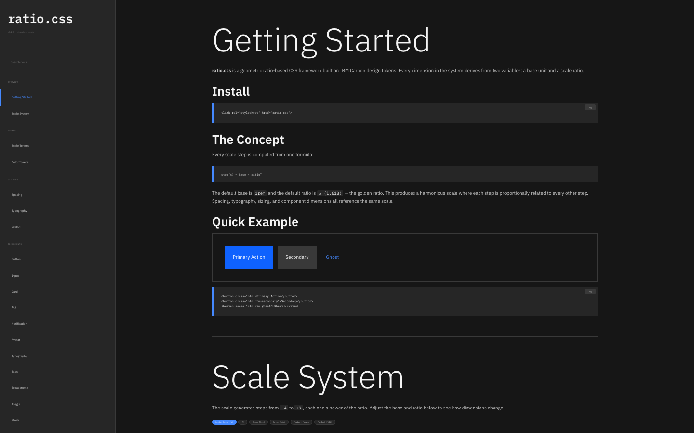
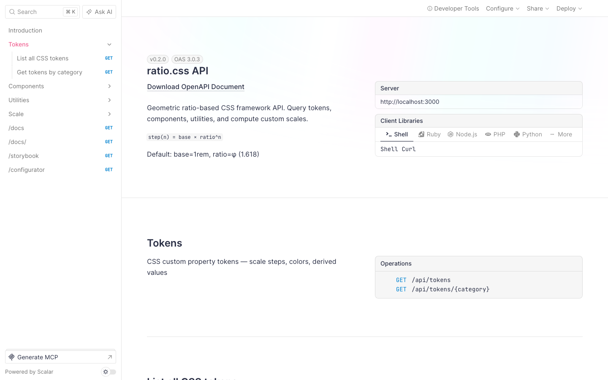
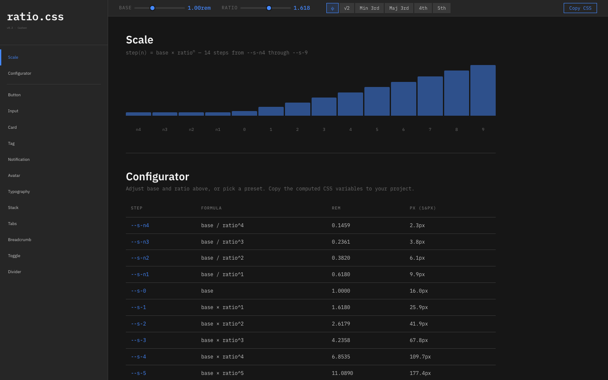

<p align="center">
  <code>step(n) = base × ratio<sup>n</sup></code>
</p>

<h1 align="center">ratio.css</h1>

<p align="center">
  <strong>Two variables. Every dimension. Pure math.</strong>
  <br />
  A geometric ratio-based CSS utility framework.<br />
  Change <code>--ratio</code> and watch everything rescale in mathematical harmony.
</p>

<p align="center">
  
  
  
  
  
</p>

---

Every CSS framework uses arbitrary spacing scales — `4px, 8px, 12px, 16px`. ratio.css replaces all of them with one formula:

```
step(n) = base × ratio^n
```

Set `--base: 1rem` and `--ratio: 1.618` (the golden ratio), and the entire scale computes itself:

| Step | Formula | Value |
|------|---------|-------|
| `--s-n2` | base / ratio² | 0.382rem |
| `--s-n1` | base / ratio | 0.618rem |
| `--s-0` | base | **1.000rem** |
| `--s-1` | base × ratio | 1.618rem |
| `--s-2` | base × ratio² | 2.618rem |
| `--s-3` | base × ratio³ | 4.236rem |

Every padding, margin, font-size, gap, border-radius, and component dimension derives from this single scale. No magic numbers.

## Screenshots

### Documentation (Puter-style)


### Swagger API Reference


### Interactive Storybook


## Quick Start

### Option A: Link the CSS

```html
<link rel="stylesheet" href="ratio.css" />
```

That's it. No build step. The CSS uses custom properties + `calc()` at runtime.

### Option B: Run the docs server

```bash
git clone https://github.com/stussysenik/ratio-css.git
cd ratio-css
bun install
bun run dev
```

Open:
- `http://localhost:3000/docs` — Documentation
- `http://localhost:3000/swagger` — API Reference (Scalar UI)
- `http://localhost:3000/storybook` — Component Storybook

## The Math

Two inputs control everything:

| Variable | Default | Purpose |
|----------|---------|---------|
| `--base` | `1rem` | Base unit |
| `--ratio` | `1.618` | Scale multiplier (φ) |

### Named Derived Values

From the original [proportional design diagram](screenshots/docs.png):

| Token | Formula | φ Value | Usage |
|-------|---------|---------|-------|
| `--v-pad` | base / ratio | 0.618rem | Vertical padding |
| `--h-pad` | base / ratio | 0.618rem | Horizontal padding |
| `--radius` | 0 | 0 | Border radius (Carbon: square) |

### Ratio Presets

| Name | Value | Origin |
|------|-------|--------|
| φ (Golden Ratio) | 1.618 | `(1+√5)/2` — nature, art, architecture |
| √2 | 1.414 | ISO paper sizes (A4/A3) |
| Minor Third | 1.200 | Musical interval 6:5 |
| Major Third | 1.250 | Musical interval 5:4 |
| Perfect Fourth | 1.333 | Musical interval 4:3 |
| Perfect Fifth | 1.500 | Musical interval 3:2 |

## Utility Classes

Tailwind-style utilities mapped to scale steps:

```html
<!-- Spacing: p-1 through p-9 -->
<div class="p-4 m-2 gap-3">

<!-- Typography: text-xs through text-5xl -->
<h1 class="text-4xl font-bold">

<!-- Layout -->
<div class="flex items-center justify-between">

<!-- Border radius -->
<div class="rounded-sm">
```

| Class | Scale Step | φ Value |
|-------|-----------|---------|
| `p-1` | `--s-n3` | 0.236rem |
| `p-2` | `--s-n2` | 0.382rem |
| `p-3` | `--s-n1` | 0.618rem |
| `p-4` | `--s-0` | 1.000rem |
| `p-5` | `--s-1` | 1.618rem |
| `p-6` | `--s-2` | 2.618rem |

Same pattern for `m-*`, `gap-*`, `text-*`, `w-*`, `h-*`.

## Components

12 pre-built components, all styled with Carbon tokens and scale variables:

```html
<!-- Button -->
<button class="btn">Primary</button>
<button class="btn btn-secondary">Secondary</button>
<button class="btn btn-tertiary">Tertiary</button>
<button class="btn btn-ghost">Ghost</button>
<button class="btn btn-danger">Danger</button>

<!-- Input -->
<label class="label">Email</label>
<input class="input" placeholder="you@example.com" />

<!-- Card -->
<div class="card">
  <div class="card-title">Title</div>
  <div class="card-body">Content</div>
</div>

<!-- Tag -->
<span class="tag tag-blue">Label</span>

<!-- Notification -->
<div class="notification notification-success">
  <div class="notification-title">Success</div>
  Operation completed.
</div>
```

Full list: `btn`, `input`, `card`, `tag`, `notification`, `avatar`, `h1`–`h6`, `tabs`, `breadcrumb`, `toggle`, `stack`, `divider`

## API

The docs server exposes a REST API for querying the framework programmatically:

| Endpoint | Method | Description |
|----------|--------|-------------|
| `/api/tokens` | GET | All CSS custom property tokens |
| `/api/tokens/:category` | GET | Tokens filtered by category |
| `/api/components` | GET | All component definitions |
| `/api/components/:name` | GET | Single component detail |
| `/api/utilities` | GET | All utility classes |
| `/api/scale` | POST | Compute scale for custom base/ratio |
| `/api/scale/presets` | GET | List ratio presets |

Interactive API docs at `/swagger` (Scalar UI with "Try It").

## Customization

Change two CSS variables to rescale everything:

```css
:root {
  --base: 0.875rem;   /* smaller base */
  --ratio: 1.25;      /* major third */
  --sqrt-ratio: 1.118; /* update this too */
}
```

Or use the interactive configurator at `/storybook` with live sliders.

## Color System

IBM Carbon Gray 100 theme. All colors are CSS custom properties:

```css
--background: #161616;
--layer-01: #262626;
--text-primary: #f4f4f4;
--text-secondary: #c6c6c6;
--interactive: #4589ff;
--button-primary: #0f62fe;
--support-success: #42be65;
--support-error: #ff8389;
```

## Tech Stack

- **CSS**: Custom properties + `calc()` — zero runtime JS, no build step
- **Docs Server**: [ElysiaJS](https://elysiajs.com) + [@elysiajs/swagger](https://elysiajs.com/plugins/swagger) (Scalar UI)
- **Runtime**: [Bun](https://bun.sh)
- **Design**: [IBM Carbon](https://carbondesignsystem.com) Gray 100
- **Fonts**: IBM Plex Sans + IBM Plex Mono
- **Math**: Geometric scale — `step(n) = base × ratio^n`

## Project Structure

```
ratio-css/
├── ratio.css              # The framework (22KB, zero deps)
├── ratio.min.css           # Minified (18KB)
├── server.ts               # ElysiaJS docs server
├── storybook.html          # Component storybook
├── configurator.html       # Interactive configurator
├── src/
│   ├── generate.ts         # CSS generator
│   ├── scale.ts            # Scale math
│   └── data/               # Token, component, utility registries
├── public/
│   ├── ratio.css           # Served at /ratio.css
│   └── docs/index.html     # Documentation SPA
└── screenshots/            # For this README
```

## License

MIT
